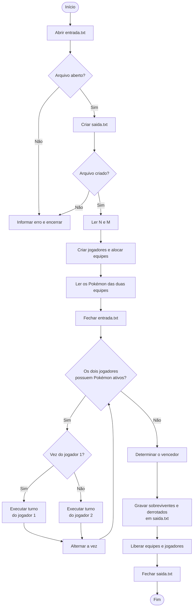

# Simulador de Batalha Pokémon

## Introdução

Este projeto implementa, em linguagem C, um simulador de batalha entre dois jogadores Pokémon. Cada jogador possui uma equipe com até 100 Pokémon. Um Pokémon é definido por nome, ataque, defesa, vida e tipo.

O programa lê as equipes no arquivo `entrada.txt` e grava o resultado da batalha em `saida.txt`. A simulação segue uma sequência de turnos, substitui Pokémon derrotados pela próxima posição da equipe e encerra quando todos os Pokémon de um dos jogadores foram derrotados.

O projeto foi desenvolvido para aplicar estruturas, alocação dinâmica de memória, funções, arquivos, condicionais e repetições em C.

## Estruturas de dados

O programa utiliza duas estruturas principais:

- `Pokemon`: armazena `nome`, `ataque`, `defesa`, `vida` e `tipo`.
- `Jogador`: armazena o vetor dinâmico `equipe`, a quantidade total de Pokémon e o índice `atual` do Pokémon em combate.

Os tipos de Pokémon são representados por um `enum`: `ELETRICO`, `AGUA`, `FOGO`, `GELO` e `PEDRA`. Isso evita que a lógica da batalha dependa de comparações textuais depois da leitura do arquivo.

Cada equipe é alocada dinamicamente com o tamanho informado na primeira linha da entrada. Ao final da execução, a função `liberar_jogador` libera o vetor da equipe e a estrutura do jogador.

## Arquivos de entrada e saída

O programa utiliza arquivos com nomes fixos:

- `entrada.txt`: contém as duas equipes;
- `saida.txt`: recebe o resultado da batalha.

O arquivo de entrada deve estar salvo em UTF-8 sem BOM e seguir este formato:

```text
N M
nome ataque defesa vida tipo
...
```

`N` é a quantidade de Pokémon do jogador 1 e `M` é a quantidade de Pokémon do jogador 2. Em seguida, são lidos primeiro os `N` Pokémon do jogador 1 e depois os `M` Pokémon do jogador 2.

Os tipos aceitos na entrada são: `eletrico`, `agua`, `fogo`, `gelo` e `pedra`.

Exemplo:

```text
3 2
Squirtle 10 15 15 agua
Vulpix 15 15 15 fogo
Onix 5 20 20 pedra
Golem 20 5 10 pedra
Charmander 20 15 12 fogo
```

## Descrição do Algoritmo e Procedimentos Utilizados

O algoritmo é dividido em quatro etapas: leitura dos dados, criação das equipes, simulação da batalha e gravação do resultado. Essa divisão também orienta as funções do programa.

### 1. Leitura e criação das equipes

O programa abre `entrada.txt` e lê inicialmente as quantidades `N` e `M` de Pokémon dos jogadores 1 e 2. Em seguida, chama `criar_jogador` para alocar dinamicamente uma estrutura `Jogador` e um vetor de `Pokemon` com a quantidade exata necessária para cada equipe.

Depois da alocação, a função `ler_pokemon` é chamada em um laço para preencher cada posição das duas equipes. Além de ler nome, ataque, defesa e vida, a função converte o texto do tipo para o valor correspondente do `enum` `TipoPokemon`.

### 2. Cálculo de dano

A função `calcular_dano` recebe os Pokémon atacante e defensor. Primeiro, ela identifica se a relação entre os tipos é forte, fraca ou neutra. O ataque é ajustado antes da comparação com a defesa:

```text
forte: ataque ajustado = ataque * 120 / 100
fraco: ataque ajustado = ataque * 80 / 100
neutro: ataque ajustado = ataque

se ataque ajustado > defesa:
    dano = ataque ajustado - defesa
caso contrário:
    dano = 1
```

O uso de aritmética inteira mantém o dano como um valor inteiro, compatível com o atributo de vida do Pokémon.

| Tipo atacante | Forte contra | Fraco contra |
| --- | --- | --- |
| Elétrico | Água | Pedra |
| Água | Fogo | Elétrico |
| Fogo | Gelo | Água |
| Gelo | Pedra | Fogo |
| Pedra | Elétrico | Gelo |

### 3. Simulação dos turnos

O jogador 1 começa a batalha. A variável `vez_jogador1` indica qual equipe possui o turno atual. Enquanto os dois jogadores ainda possuem Pokémon disponíveis, o programa chama a função `turno` com o atacante e o defensor corretos e inverte a variável de vez ao final da rodada.

Na função `turno`, o programa acessa os Pokémon ativos pelos índices `atual`, calcula o dano, reduz a vida do defensor e verifica se ele foi derrotado. Caso a vida fique menor ou igual a zero, a linha `Atacante venceu Defensor` é gravada em `saida.txt` e o índice `atual` da equipe derrotada é incrementado. Assim, o próximo Pokémon dessa equipe passa a ser o ativo no turno seguinte.

Em pseudocódigo, a parte principal da batalha é:

```text
vez_jogador1 = verdadeiro

enquanto jogador 1 e jogador 2 possuírem Pokémon ativos:
    se vez_jogador1:
        executar turno(jogador 1, jogador 2)
    senão:
        executar turno(jogador 2, jogador 1)

    inverter vez_jogador1
```

### 4. Geração da saída e liberação de memória

Quando o índice atual de uma equipe alcança sua quantidade total de Pokémon, a batalha termina. O programa identifica o vencedor, escreve seus sobreviventes e lista os derrotados das duas equipes em `saida.txt`.

Por fim, `liberar_jogador` libera o vetor dinâmico de cada equipe e a estrutura de cada jogador. Os arquivos abertos também são fechados antes do encerramento do programa.

### Diagrama lógico da execução



## Exemplo de Execução

O exemplo abaixo utiliza três Pokémon para o jogador 1 e quatro para o jogador 2. Ele demonstra leitura dos dados, alternância de turnos, vantagem de tipo e substituição de Pokémon derrotados.

### Input

Conteúdo de `entrada.txt`:

```text
3 4
Squirtle 20 10 15 agua
Vulpix 15 10 15 fogo
Onix 12 12 15 pedra
Charmander 18 10 10 fogo
Pikachu 20 12 10 eletrico
Geodude 10 10 10 pedra
Spheal 10 10 10 gelo
```

### Processo

1. O programa lê os valores `3` e `4` e aloca duas equipes: uma com três Pokémon e outra com quatro.
2. Squirtle começa a batalha contra Charmander. Como Água é forte contra Fogo, o ataque de Squirtle é aumentado em 20\% e Charmander é derrotado.
3. Pikachu entra para o jogador 2 e, por ser do tipo Elétrico, causa dano aumentado contra Squirtle, derrotando-o no turno seguinte.
4. Vulpix entra para o jogador 1, derrota Pikachu e depois enfrenta Geodude. Como a relação entre Fogo e Pedra é neutra, o dano usa o ataque original de Vulpix.
5. Após derrotar Geodude, Vulpix enfrenta Spheal. Fogo é forte contra Gelo, portanto Vulpix recebe novamente o bônus de 20\% e derrota o último Pokémon do jogador 2.
6. O programa identifica o jogador 1 como vencedor, registra Vulpix e Onix como sobreviventes, lista os derrotados e libera a memória das equipes.

### Output

Conteúdo esperado de `saida.txt`:

```text
Squirtle venceu Charmander
Pikachu venceu Squirtle
Vulpix venceu Pikachu
Vulpix venceu Geodude
Vulpix venceu Spheal
Jogador 1 venceu
Pokemon sobreviventes:
Vulpix Onix
Pokemon derrotados:
Squirtle Charmander Pikachu Geodude Spheal
```

## Resultado gerado

Ao fim da simulação, `saida.txt` informa:

1. os vencedores de cada confronto entre Pokémon;
2. o jogador vencedor;
3. os Pokémon sobreviventes do vencedor;
4. os Pokémon derrotados do jogador 1 e depois do jogador 2.

Para o exemplo de entrada anterior, a saída esperada é:

```text
Squirtle venceu Golem
Charmander venceu Squirtle
Vulpix venceu Charmander
Jogador 1 venceu
Pokemon sobreviventes:
Vulpix Onix
Pokemon derrotados:
Squirtle Golem Charmander
```

## Compilação e execução

Com GCC, compile o programa no diretório do projeto:

```bash
gcc -std=c11 -Wall -Wextra -Wpedantic main.c pokemon.c jogador.c -o pokemon
```

No Windows, o executável pode ser chamado de `pokemon.exe`:

```powershell
.\pokemon.exe
```

No Linux ou macOS:

```bash
./pokemon
```

O executável deve estar no mesmo diretório de `entrada.txt`. Depois da execução, consulte `saida.txt`.

## Decisões de implementação

- As equipes usam alocação dinâmica para ocupar apenas a quantidade de posições necessária.
- Os Pokémon permanecem no vetor original; a troca de um derrotado é controlada apenas pelo índice `atual`, sem deslocar elementos.
- Os tipos são convertidos para `enum` durante a leitura e comparados numericamente durante a batalha.
- Os nomes dos arquivos de entrada e saída foram definidos como constantes no código para simplificar a execução e a correção.
- A memória alocada para as duas equipes é liberada antes do encerramento do programa.

## 3. Testes e Erros

### Processo de Criação do Algoritmo

O algoritmo foi desenvolvido de forma incremental. Primeiro, foram definidas as estruturas `Pokemon` e `Jogador`, além das funções de alocação e liberação de memória. Depois, foram implementadas a leitura de `entrada.txt`, a conversão dos tipos e a gravação de `saida.txt`.

Com as equipes preenchidas, foi criada a função de cálculo de dano e, em seguida, a função responsável por executar um turno. Por fim, foram adicionados o controle da vez de cada jogador, a substituição de Pokémon derrotados e a impressão do resultado final. A cada alteração, o programa foi compilado com os avisos `-Wall`, `-Wextra` e `-Wpedantic` e executado com entradas de teste.

### Exemplos de Erros Comuns e Correções

**Erro: dano igual a zero quando o ataque não superava a defesa.**

Nas primeiras tentativas, um dano nulo fazia alguns confrontos repetirem indefinidamente, pois nenhum dos Pokémon perdia vida.

1. **Correção:** a função `calcular_dano` passou a retornar `1` sempre que a diferença entre ataque ajustado e defesa fosse menor ou igual a zero.

**Erro: modificador de tipo aplicado de forma incorreta.**

O bônus e a penalidade de tipo precisavam afetar somente o ataque do atacante e seguir os valores de 20% definidos no enunciado.

2. **Correção:** foram utilizadas as expressões `ataque * 120 / 100` para vantagem e `ataque * 80 / 100` para fraqueza. A defesa do Pokémon oponente permanece inalterada.

**Erro: arquivo de entrada salvo com BOM.**

Quando `entrada.txt` foi salvo como UTF-8 com BOM, os primeiros bytes do arquivo impediram a leitura correta dos valores `N` e `M` por `fscanf`.

3. **Correção:** o arquivo de entrada passou a ser salvo como UTF-8 sem BOM, e o retorno de `fscanf` é verificado antes de continuar a execução.

### Testes Realizados

Foram realizados testes com quantidades diferentes de Pokémon, relações forte, fraca e neutra entre tipos, substituição de Pokémon e dano mínimo.

#### Caso 1 — Exemplo do enunciado

```text
3 2
Squirtle 10 15 15 agua
Vulpix 15 15 15 fogo
Onix 5 20 20 pedra
Golem 20 5 10 pedra
Charmander 20 15 12 fogo
```

**Resultado esperado e obtido:** jogador 1 vence; Vulpix e Onix sobrevivem; Squirtle, Golem e Charmander são derrotados.

#### Caso 2 — Vantagem de tipo e substituição de Pokémon

```text
3 4
Squirtle 20 10 15 agua
Vulpix 15 10 15 fogo
Onix 12 12 15 pedra
Charmander 18 10 10 fogo
Pikachu 20 12 10 eletrico
Geodude 10 10 10 pedra
Spheal 10 10 10 gelo
```

**Resultado esperado e obtido:** jogador 1 vence; Squirtle derrota Charmander, Pikachu derrota Squirtle e Vulpix derrota Pikachu, Geodude e Spheal. Vulpix e Onix permanecem como sobreviventes.

#### Caso 3 — Dano mínimo

```text
1 1
Onix 5 20 10 pedra
Charmander 20 20 3 fogo
```

Nesse caso, os ataques não superam as defesas e, portanto, o programa deve aplicar dano mínimo de uma unidade. **Resultado esperado e obtido:** Onix derrota Charmander e o programa encerra a batalha sem entrar em loop infinito.

## Conclusão

O simulador implementa as regras principais da batalha Pokémon, incluindo turnos alternados, dano mínimo, relações entre tipos, substituição de Pokémon derrotados e geração do resultado em arquivo. A solução organiza as responsabilidades em estruturas e funções separadas, utiliza alocação dinâmica para as equipes e libera a memória antes do encerramento do programa.
